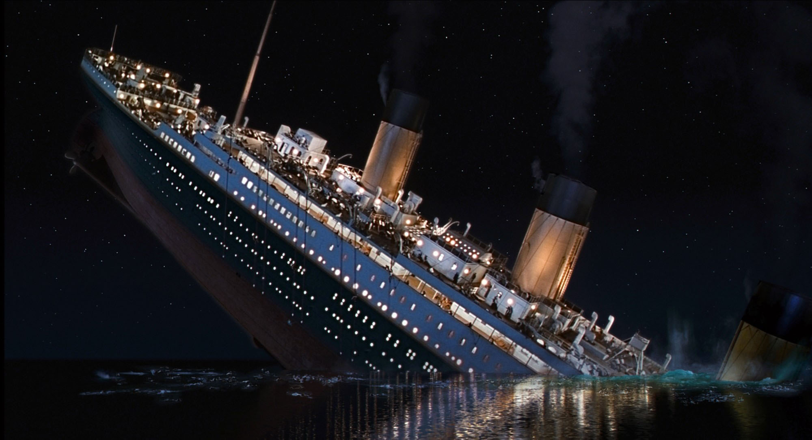
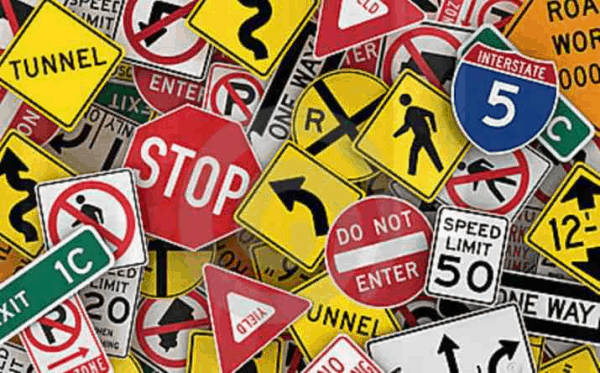

# I am sharing few of my Data Science projects whitch are published in my Kaggle account:

## 1- Titanic_Gender_Label

In this Task we are using Titanic dataset including name feature, but with a little bit changing in the target. we consider the label in this task not Survived like in the famous competition but Sex.So the task is predict the gender of the passangers. I wanted to see the effects of processing the text on changing the accuracy. For that, i have used some simple features of NLP to process Name texts.
On April 15, 1912, during her maiden voyage, the Titanic sank after colliding with an iceberg, killing 1502 out of 2224 passengers and crew. Translated 32% survival rate. One of the reasons that the shipwreck led to such loss of life was that there were not enough lifeboats for the passengers and crew. Although there was some element of luck involved in surviving the sinking, some groups of people were more likely to survive than others, such as women, children, and the upper-class. In this Kernel , you are going to find a solution for normal Titanik kaggle competition where the survived column is a label.
I want to see the effects of processing the text on changing the accuracy. For that, i will use some simple features of NLP to process Name texts.

You can see all results with all descriptions in my Kaggle account: [Kaggle/YoussefAlsoufi/Titanic_Gender_Lablel](https://www.kaggle.com/code/youssefalsoufi/titanic-gender-label).

## 2- Tuning Hyper parameters Titanic_Survived_Label

Even though there are so much solutions for this dataset entries but i wanted to put some of my ideas supported with the required explanations to solve competition like this. In this script we will use Random and Grid search techniques to tune the Hyper parameters of the algorithms of ML.
On April 15, 1912, during her maiden voyage, the Titanic sank after colliding with an iceberg, killing 1502 out of 2224 passengers and crew. Translated 32% survival rate. One of the reasons that the shipwreck led to such loss of life was that there were not enough lifeboats for the passengers and crew. Although there was some element of luck involved in surviving the sinking, some groups of people were more likely to survive than others, such as women, children, and the upper-class. In this Kernel , you are going to find a solution for normal Titanik kaggle competition where the survived column is a label.
Go to this link for more details where, In this script we will use Random and Grid search techniques to tune the Hyper parameters of the algorithms of ML.

[Kaggle/YoussefAlsoufi/Titanic_Survived_Label](https://www.kaggle.com/code/youssefalsoufi/tuning-hyper-parameters-titanic-survived-label). ✌🏼

## 3- GTSRB classification-CNN with external camera

It is known that CNN help in running neural networks directly on images and are more efficient and accurate than many of the deep neural networks. In this task, I have used tensorflow-keras package to build CNN model. I have used the German traffic signs detection dataset will be used in this task to recognize the traffic signs by external camera connected with the trained model. The dataset consists of 39209 images as a train data and 12630 images as test data with 43 different classes. Also there is a file attached to the data (Meta)file contains 43 different images (100,100,3) to make the last test before implementing and testing the model by the external camera. 

[Kaggle/YoussefAlsoufi/GTSRB classification-CNN with external camera](https://www.kaggle.com/code/youssefalsoufi/gtsrb-classification-cnn-with-external-camera).

 
